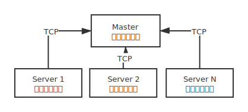
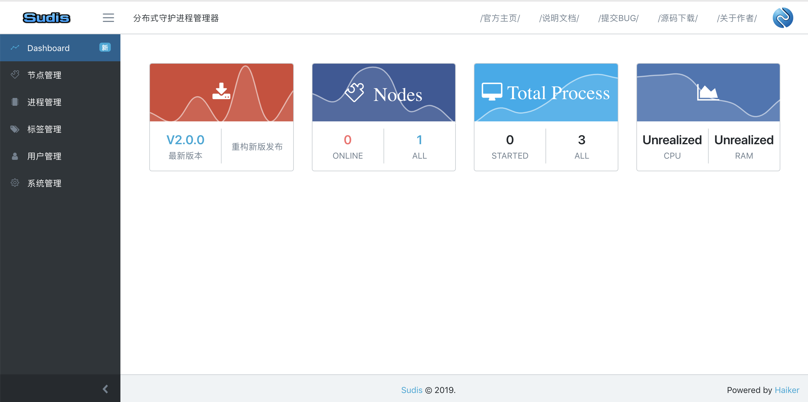
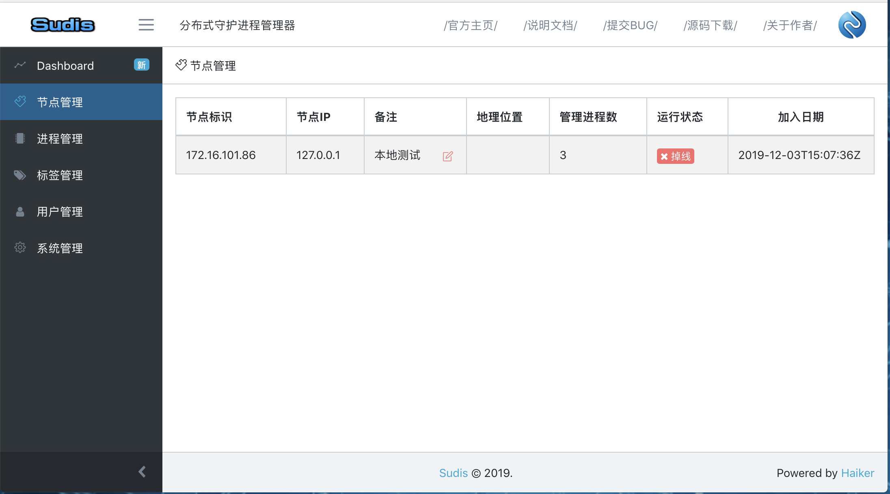
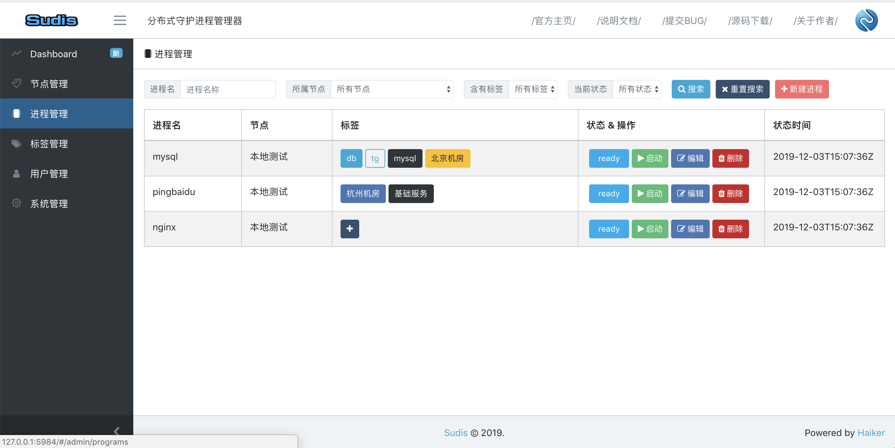
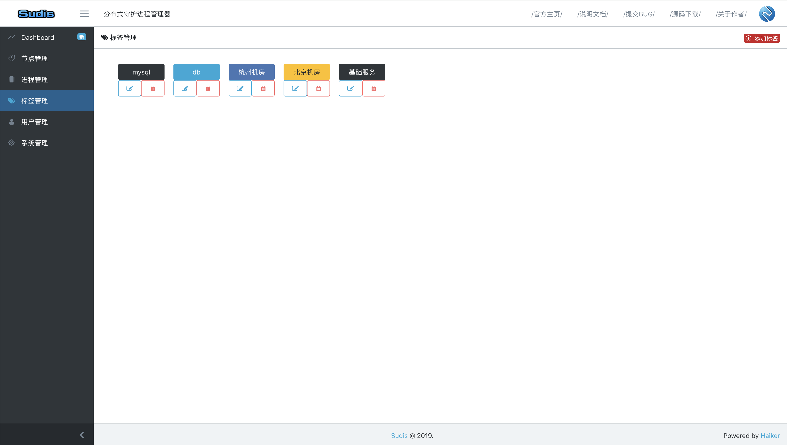

# Sudis

Sudis !! Distributed supervisor process control system.

[中文说明](README_ZH.md) | English  

## Installation

Step-by-step instruction are provided in [docs/INSTALL.md](docs/INSTALL.md)

## Futures

- Support for distributed management.
- Program status change notification.

## How to Contribute

Contributions are warmly welcome! Be it trivial cleanup, major new feature or other suggestion. 
Read this how to contribute guide for more details.

See [CONTRIBUTING.md](docs/CONTRIBUTING.md)

## Changelog
see [CHANGELOG.md](docs/CHANGELOG.md)

## TODOLIST

- [X] Send status change notification. (webhook, email, sms, gNotify). [gNotify](https://github.com/ihaiker/gNotify) is in the design and development stage

## Technical Support

